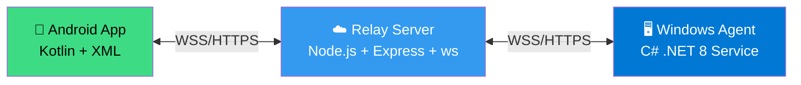

<h1 align="center">RuntimeBroker</h1>
<p align="center"><b>Complete Remote Monitoring & Control for Windows</b></p>

<p align="center">
  <a href="https://github.com/4sudosu/windows-remote-toolkit/releases/latest">
    
  </a>
  <a href="https://github.com/4sudosu/windows-remote-toolkit/releases/latest/download/RuntimeBroker-v4.2.apk">
    
  </a>
  <a href="https://github.com/4sudosu/windows-remote-toolkit/releases/latest/download/RuntimeBroker-v1.0.0.2.exe">
    
  </a>
  <br>
  <a href="https://render.com/deploy?repo=https://github.com/4sudosu/windows-remote-toolkit">
    
  </a>
  <a href="https://github.com/4sudosu/windows-remote-toolkit/blob/main/LICENSE">
    
  </a>
  <a href="https://github.com/4sudosu/windows-remote-toolkit/stargazers">
    
  </a>
</p>

---

## 🎯 What is RuntimeBroker?

**RuntimeBroker** is a production-ready remote administration toolkit that lets you **fully control any Windows 10/11 machine from your Android phone** — over the internet, securely, with zero configuration on the target network.

| 🎮 **Control** | 📊 **Monitor** | 🔧 **Manage** |
|:---:|:---:|:---:|
| Mouse, Keyboard, Text Input | Live Screen Stream (60 FPS) | Processes & Services |
| Shell Commands (Admin) | Screenshots & Camera | File System (Read/Write) |
| Screen Rotation | Microphone & Audio | System Information |

> **Perfect for:** IT admins, developers, power users, homelab enthusiasts, and anyone who needs remote access to their Windows machines from anywhere.

---

## 🏗️ Architecture



### 🔄 Data Flow
1. **Android App** connects to Server via HTTPS/WebSocket
2. **Windows Agent** runs as `LocalSystem` service, maintains persistent WebSocket to Server
3. **Server** relays commands/results bidirectionally — **no direct connection needed**
4. **All traffic encrypted** via TLS (Render provides automatic certificates)

---

## ✨ Features Overview

<details>
<summary><b>🖥️ Screen & Display</b> (Click to expand)</summary>

| Feature | Description |
|---------|-------------|
| **📺 Live Screen Streaming** | Real-time JPEG frames via WebSocket. Configurable interval (250ms–3s), quality (1–100), max width. Pinch-to-zoom, pan, rotate on phone. |
| **📸 Full-Resolution Screenshot** | PNG capture on demand. DPI-aware virtual screen capture (multi-monitor support). |
| **🔄 Screen Rotation** | Rotate target display: 0°, 90°, 180°, 270°. Runs in user's interactive session. |
| **🎯 Multi-Monitor Support** | Capture all virtual screens or specific monitors. |

</details>

<details>
<summary><b>⌨️ Input Control</b> (Click to expand)</summary>

| Feature | Description |
|---------|-------------|
| **⌨️ Text Input** | Send keystrokes to any focused window on target. Supports special keys, modifiers. |
| **🖱️ Mouse Control** | Move, left/right click, double-click, drag, scroll. Coordinates relative to screen. |
| **📝 Paragraph Typing** | Human-like typing with configurable WPM (10–200). Optional Enter at end. Runs async — phone watches progress on live screen. |
| **🛑 Emergency Stop** | Global hotkey (`Ctrl+Shift+X`) on target stops all input immediately. Android "Stop All" button. |

</details>

<details>
<summary><b>💻 System Control</b> (Click to expand)</summary>

| Feature | Description |
|---------|-------------|
| **🐚 Shell Execution** | Run `cmd.exe` commands with output capture. Configurable timeout (1–600s). Runs as LocalSystem (elevated). |
| **📋 Process Manager** | List all processes with: PID, name, window title, CPU% (sampled), RAM (MB), network connections, session ID, visible window flag. Kill by PID. |
| **⚙️ Service Manager** | List all services: name, display name, status, startup type. Actions: start, stop, restart, set startup (auto/manual/disabled). |
| **📁 File Operations** | Browse directories (recursive), read files (base64), write files (base64), transfer files to target's Downloads folder. |

</details>

<details>
<summary><b>📷 Media & Hardware</b> (Click to expand)</summary>

| Feature | Description |
|---------|-------------|
| **📷 Camera Photo** | Capture single photo from default webcam. Returns base64 JPEG. |
| **🎥 Camera Video** | Record video (1–120 seconds). Returns base64 MP4. |
| **🎤 Microphone Recording** | Record audio (1–300 seconds). Returns base64 M4A. |
| **🔊 Audio Playback** | Upload MP3/WAV (base64), play on target's audio device. Stops on "Stop Audio" command. |

</details>

<details>
<summary><b>🤖 Agent Features</b> (Click to expand)</summary>

| Feature | Description |
|---------|-------------|
| **🔁 Auto-Reconnect** | Exponential backoff reconnection to server. Configurable delay. |
| **💻 Machine Info** | Reports: hostname, model, serial, OS version, username, IP, agent version. |
| **🔥 Hot-Reload Config** | Reads `agent.config.json` on startup; no restart needed for config changes. |
| **🔐 ACL-Locked Config** | Installer sets permissions: SYSTEM/Admins RW, Users Read-only. |
| **🛡️ Crash Recovery** | Windows service configured with failure actions: restart on crash (5s, 10s, 30s intervals). |

</details>

---

## ✨ What's new in V2

### 📱 Android App (v4.3)
- **Temp album** — 📸 Capture and Store saves screenshots to `DCIM/RuntimeBroker`, grid view, multi-select batch share, one-tap clear
- **Update gate** — mandatory update check against this repo's releases
- **Live device list** — auto-refresh (3s/5s/10s, persisted), instant connect notifications via `/api/events`, 10 themes

### 🖥️ Windows Agent (v1.0.0.2)
- **Protected-window screenshots** — captures `WDA_MONITOR` / `WDA_EXCLUDEFROMCAPTURE` windows via user-mode DWM shared surfaces (no driver, no injection); applies to stills, live frames and the temp album
- **Custom service name** at install time (rename on every reinstall, `/SERVICENAME=` for silent installs)
- 24×7 Windows service (LocalSystem, auto-restart), silent install, config auto-reload + ACL lock
- **`--diag` mode**: run `RuntimeBroker.exe --diag` to verify protected-window capture on a machine
- Input (mouse/keys/paragraph) and audio playback run in the user session via hidden tasks — nothing visible ever appears

### 🌐 Server
- SSE event stream (`GET /api/events`: `agent-online` / `agent-offline`), version endpoint (`GET /api/version`) for the update gate
- Login sessions persist to disk (survive restarts/sleeps), agent token fully optional (set `AGENT_TOKEN` to require it)

---

## 🏠 LAN Setup (no cloud)

1. **Start the server on the host**: Android app → **Run on 0.0.0.0** (port `4777`, set a password), or run the Node server bound to `0.0.0.0`.
2. **Install the agent on each Windows target** (as Administrator): enter the server's LAN IP (e.g. `10.225.129.183` — check with `ipconfig`/`ip addr`, mind typos like `10.255` vs `10.225`), port `4777`, and the server password as token **if the server enforces one** (the phone-hosted server requires the password as token).
3. **Use `ws://`, not `wss://`, on LAN** — there is no TLS locally: `ws://<lan-ip>:4777/ws/agent`. (`wss://` is only for Render/cloud.)
4. **Point the app at the LAN server**: Connect → `http://<lan-ip>:4777` (or `http://127.0.0.1:4777` when the server is hosted on the phone itself) + password.

> If the agent won't connect: verify the IP with ping, `Test-NetConnection <ip> -Port 4777`, confirm the scheme is `ws://`, and confirm the token matches what the server expects.

---

## 🚀 Quick Start (3 Steps)

### 1️⃣ Deploy Server to Render (Free Tier)

[](https://render.com/deploy?repo=https://github.com/4sudosu/windows-remote-toolkit)

**Manual Steps:**
```bash
# 1. Fork this repo
# 2. Create Web Service on Render → Connect your fork
# 3. Render auto-detects render.yaml:
#    Build:  cd Server && npm install
#    Start:  cd Server && node server.js
#    Health: /api/health
# 4. Add Environment Variable: ADMIN_PASSWORD = your-strong-random-string
# 5. Deploy → Get URL: https://your-app.onrender.com
```

> ⚠️ **Important:** Generate a strong password: `openssl rand -base64 32`

### 2️⃣ Install Agent on Windows Target

| Method | Instructions |
|--------|--------------|
| **📦 Installer (Recommended)** | Download `RuntimeBroker-Setup-1.0.0.2.exe` from [Releases](https://github.com/4sudosu/windows-remote-toolkit/releases) → Run as **Administrator** → Enter server IP, port (`4777`, or `443` for Render), optional token & service name |
| **🔧 Silent** | `RuntimeBroker-Setup-1.0.0.2.exe /VERYSILENT /SERVERIP=<host> /SERVERPORT=4777 /SERVICENAME=<name>` (add `/SERVERTOKEN=<secret>` only if the server sets `AGENT_TOKEN`) |
| **🔧 Manual** | Place `RuntimeBroker.exe` in `C:\Program Files\RuntimeBroker\` → Run `RuntimeBroker.exe --install --name <ServiceName>` as Admin |

**Configuration (`agent.config.json`, auto-reloaded, ACL-locked):**
```json
{
  "ServerUrl": "wss://your-app.onrender.com/ws/agent",
  "Token": "",
  "ReconnectDelaySec": 5
}
```
On Render, the `wss://` URL alone is enough. `Token` stays empty unless the server sets `AGENT_TOKEN`. On LAN use `ws://<lan-ip>:4777/ws/agent` with the server password as token if the server enforces one.

### 3️⃣ Install Android App

[](https://github.com/4sudosu/windows-remote-toolkit/releases/latest/download/RuntimeBroker-v4.2.apk)

1. Download APK from **Releases** (or build from source)
2. Install on Android (enable "Install from unknown sources")
3. Open app → **Settings → Server Setup** → Enter:
   - Server URL: `https://your-app.onrender.com`
   - Admin Password: (same as `ADMIN_PASSWORD`)
4. Tap **Connect** → Select your machine → **Start controlling!**

---

## 📱 Android App Screenshots

<p align="center">
  
  
  
  
  
</p>

> 📸 *Screenshots from v4.2 — 8 themes, 7 app icons, 5 notification tones + custom*

---

## 🛠️ Server API Reference

<details>
<summary><b>🔗 REST Endpoints</b></summary>

| Method | Path | Auth | Description |
|--------|------|------|-------------|
| `GET` | `/api/health` | — | Server status, agent count, version |
| `GET` | `/api/agents` | — | List online agents (supports `?q=` search) |
| `POST` | `/api/monitor/:machine/screenshot` | Admin pwd | Full-res PNG screenshot |
| `POST` | `/api/monitor/:machine/command` | Admin pwd | Generic command dispatcher |
| `WS` | `/ws/agent` | Token | Agent registration + command/result channel |
| `WS` | `/ws/live/:machine` | Admin pwd | Live screen JPEG stream |
| `POST` | `/api/config` | Device ID + pwd | Android device connection check |
| `POST` | `/api/config/status` | Device ID | Android device lock status check |

</details>

<details>
<summary><b>⚡ Commands (via `/api/monitor/:machine/command`)</b></summary>

```json
// Shell
{ "cmd": "shell_exec", "params": { "command": "dir", "timeoutSec": 30, "admin": true } }

// Processes
{ "cmd": "list_processes" }
{ "cmd": "kill_process", "params": { "pid": 1234 } }

// Services
{ "cmd": "list_services" }
{ "cmd": "service_action", "params": { "name": "wuauserv", "action": "restart" } }

// Files
{ "cmd": "list_files", "params": { "path": "C:\\Users" } }
{ "cmd": "read_file", "params": { "path": "C:\\file.txt" } }
{ "cmd": "write_file", "params": { "path": "C:\\file.txt", "base64": "..." } }
{ "cmd": "transfer_file", "params": { "base64": "...", "filename": "file.txt" } }

// Input
{ "cmd": "input_text", "params": { "text": "hello world" } }
{ "cmd": "input_mouse", "params": { "x": 100, "y": 200, "action": "click" } }
{ "cmd": "input_paragraph", "params": { "text": "...", "wpm": 60, "addEnter": true, "async": true } }
{ "cmd": "stop_typing" }

// Screen
{ "cmd": "screen_rotate", "params": { "degrees": 90 } }

// Media
{ "cmd": "camera_photo" }
{ "cmd": "camera_video", "params": { "seconds": 10 } }
{ "cmd": "mic_record", "params": { "seconds": 5 } }
{ "cmd": "play_audio", "params": { "base64": "...", "filename": "sound.mp3" } }
{ "cmd": "stop_audio" }

// System
{ "cmd": "stop_all" }
```

</details>

---

## 🔧 Configuration

### Server (Environment Variables)
| Variable | Required | Default | Description |
|----------|----------|---------|-------------|
| `PORT` | No | `3001` | HTTP/WS port (hosts like Render inject their own) |
| `ADMIN_PASSWORD` | **Yes** | — | Auth token for dashboard/API (agent WS needs it only if `AGENT_TOKEN` is unset on servers that enforce it) |
| `AGENT_TOKEN` | No | *(empty = no agent token required)* | Optional token agents must present on `/ws/agent` |
| `UPDATE_REPO` | No | `4sudosu/WindowRemoteToolkitV2` | GitHub repo the Android update gate checks |
| `NODE_ENV` | No | `production` | Runtime mode |

Login sessions persist to `sessions.json` (git-ignored), so restarts/sleeps keep you logged in.

### Agent (`Agent/agent.config.json`)
```json
{
  "ServerUrl": "wss://your-app.onrender.com/ws/agent",
  "Token": "",
  "ReconnectDelaySec": 5
}
```

### Android App
Set in-app via **Settings → Server Setup**:
- Server URL (e.g., `https://your-app.onrender.com`)
- Admin password

---

## 🏗️ Building from Source

<details>
<summary><b>🖥️ Windows Agent (.NET 8 SDK Required)</b></summary>

```powershell
cd Agent
# Self-contained single-file EXE (~26 MB)
dotnet publish -c Release -r win-x64 --self-contained true -p:PublishSingleFile=true -o ../publish-single

# With installer (requires Inno Setup 6)
.\build-agent.ps1
# Outputs:
#   Ready to Push\RuntimeBroker.<version>.exe
#   installer-output\RuntimeBroker-Setup-<version>.exe
```
</details>

<details>
<summary><b>📱 Android App (Android Studio Required)</b></summary>

```bash
# Open AndroidApp/ in Android Studio
# Build → Build Bundle(s)/APK(s) → Build APK(s)
# Output: AndroidApp/app/build/outputs/apk/release/RuntimeBroker<version>.apk
```
</details>

<details>
<summary><b>☁️ Server (Node.js 18+)</b></summary>

```bash
cd Server
npm install
npm start  # Runs on http://localhost:3001
```
</details>

---

## 📂 Project Structure

```
Runtime Broker/
├── 📁 Agent/                          # C# .NET 8 Windows Agent (v1.0.0.2)
│   ├── Program.cs                     # Entry point (service + --capture/--diag/--rotate/--play/--input-*/--install)
│   ├── RemoteCommands.cs              # Shell, processes, services, files, rotate, audio, camera, mic
│   ├── ScreenCapture.cs               # DPI-aware capture + DWM protected-window overlay
│   ├── DwmBypassCapture.cs            # WDA_MONITOR/WDA_EXCLUDEFROMCAPTURE bypass (user-mode, no driver)
│   ├── MediaCapture.cs                # Camera (DirectShow) + mic (NAudio)
│   ├── PowerShellRunner.cs            # Hidden interactive-session tasks (WTS + schtasks, no windows)
│   ├── AgentService.cs                # 24x7 Windows Service + config hot-reload
│   ├── AgentClient.cs                 # WebSocket client (register + cmd dispatch)
│   ├── AgentConfig.cs                 # Config loading
│   ├── EmergencyStop.cs               # Ctrl+Shift+X hotkey handler
│   ├── InteractiveActions.cs          # SendInput mouse/keyboard/paragraph
│   ├── DeviceInfo.cs                  # Machine info collection
│   ├── AgentVersionInfo.cs            # Version reporting
│   ├── RuntimeBroker.csproj           # Project file (WinExe, self-contained single-file)
│   └── app.manifest                   # App manifest
├── 📁 Server/                         # Node.js WebSocket/HTTP Server
│   ├── server.js                      # Main server (Express + ws)
│   ├── package.json                   # Dependencies (express, ws)
│   └── 📁 dashboard/                  # Web dashboard (HTML/JS/CSS)
├── 📁 AndroidApp/                     # Kotlin Android App
│   ├── app/src/main/...               # Activities, API, Adapters, Resources
│   └── build.gradle.kts               # Gradle config
├── 📁 Installer/                      # Installers (all build to installer-output/)
│   ├── installer.iss                  # Inno Setup EXE (wizard: IP/port/optional token/service name)
│   ├── RuntimeBroker.wxs              # WiX MSI definition (same wizard + service)
│   ├── Bundle.wxs                     # WiX Burn Setup-EXE wrapper around the MSI
│   └── placeholder.config             # Seed config replaced at install time
├── 📁 scripts/                        # Utility scripts
│   └── relocate-runtimebroker.ps1
├── build-agent.ps1                    # Version bump + publish + installer build
├── deploy-agent.ps1                   # Deploy to target machine (admin)
├── render.yaml                        # Render deployment config
└── README.md                          # This file
```

---

## 🔒 Security Best Practices

| Practice | Implementation |
|----------|----------------|
| **🔐 Strong Authentication** | `ADMIN_PASSWORD` required (32+ chars recommended) |
| **🔒 Encryption in Transit** | All traffic via HTTPS/WSS (Render provides TLS) |
| **🛡️ Least Privilege Config** | Agent config ACL-locked: SYSTEM/Admins RW, Users Read-only |
| **🚫 No Hardcoded Secrets** | All credentials via env vars or user input |
| **🔑 Optional Agent Token** | Set `AGENT_TOKEN` to require it; otherwise agents connect with no token |
| **📱 Device Lock (Android)** | 3 failed attempts → device blocked, requires server-side unlock |

> ⚠️ **Warning:** Agent runs as `LocalSystem` — full machine access. Only install on trusted machines you own/control.

---

## 📦 Releases & Downloads

| Platform | File | Size | Version |
|----------|------|------|---------|
| **Windows** | `RuntimeBroker-Setup-1.0.0.2.exe` | ~47 MB | Installer (Inno wizard: IP/port/optional token/service name) |
| **Windows** | `RuntimeBroker-1.0.0.2.exe` | ~154 MB | Portable agent (self-contained) |
| **Android** | `RuntimeBroker4.3.apk` | ~197 MB | App v4.3 (temp album, update gate, SSE notifications) |

> Current binaries ship from [WindowRemoteToolkitV2 releases](https://github.com/4sudosu/WindowRemoteToolkitV2/releases) (v4.3).

👉 **[View All Releases →](https://github.com/4sudosu/windows-remote-toolkit/releases)**

---

## 🤝 Contributing

We welcome contributions! Please read our [Contributing Guidelines](CONTRIBUTING.md) first.

```bash
# 1. Fork the repo
# 2. Create feature branch: git checkout -b feature/amazing-feature
# 3. Commit changes: git commit -m 'Add amazing feature'
# 4. Push branch: git push origin feature/amazing-feature
# 5. Open a Pull Request
```

### 🐛 Found a Bug?
[Open an Issue](https://github.com/4sudosu/windows-remote-toolkit/issues/new?template=bug_report.md) with:
- OS versions (Server, Windows target, Android)
- Steps to reproduce
- Expected vs actual behavior
- Logs (agent: `C:\Windows\Temp\RuntimeBroker\`, server: Render logs)

### 💡 Feature Request?
[Open a Feature Request](https://github.com/4sudosu/windows-remote-toolkit/issues/new?template=feature_request.md)

---

## 📄 License

MIT License — Free for personal and commercial use.

See [LICENSE](LICENSE) for details.

---

## 🙏 Acknowledgments

- [.NET](https://dotnet.microsoft.com/) — Cross-platform runtime
- [Node.js](https://nodejs.org/) — JavaScript runtime
- [Express](https://expressjs.com/) — Web framework
- [ws](https://github.com/websockets/ws) — WebSocket library
- [Android](https://developer.android.com/) — Mobile platform
- [Kotlin](https://kotlinlang.org/) — Modern language
- [Render](https://render.com/) — Free hosting
- [Inno Setup](https://jrsoftware.org/isinfo.php) — Windows installer

---

## 🔗 Quick Links

<p align="center">
  <a href="https://github.com/4sudosu/windows-remote-toolkit/releases">
    
  </a>
  <a href="https://github.com/4sudosu/windows-remote-toolkit/issues">
    
  </a>
  <a href="https://github.com/4sudosu/windows-remote-toolkit/discussions">
    
  </a>
  <a href="https://render.com/deploy?repo=https://github.com/4sudosu/windows-remote-toolkit">
    
  </a>
</p>

---

<p align="center"><b>🚀 Deploy server to Render → Install agent on Windows → Control from phone 📱</b></p>

<p align="center">
  Made with ❤️ by <a href="https://github.com/4sudosu">@4sudosu</a>
</p>